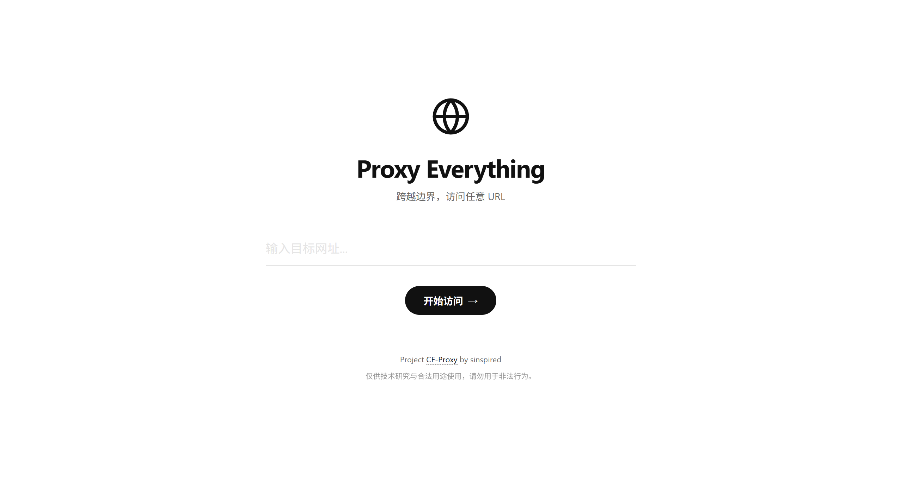

<h1 align="center">🌐 CF-Proxy</h1>
<div align="center">


**基于 Cloudflare Workers 的极简通用代理服务**

*跨越边界，访问任意 URL*

[快速部署](#-快速部署) • [高级配置](#-高级配置) • [使用说明](#-使用说明)

</div>

## 📖 简介

**CF-Proxy** 是一个运行在 Cloudflare 全球边缘网络上的轻量级通用代理工具。

它提供了一个**现代、极简的 Web 界面**，支持深色模式，专注于纯净的访问体验。同时，它具备强大的后端代理能力，支持 CORS 跨域、自动协议补全，并针对 GitHub API 进行速率配额优化。

## ✨ 功能特性

- **⚡️ 全球加速**：依托 Cloudflare 庞大的边缘网络，提供低延迟代理体验。
- **🎨 极简设计**：精致 UI，自适应深浅色模式，无干扰的输入体验。
- **🚀 GitHub 增强**：配置 `GH_TOKEN` 后，可提升 GitHub API 速率限制至 5000 次/小时。
- **🔓 开发友好**：自动处理 CORS 头，移除 `X-Frame-Options`，便于跨域调用。
- **📱 全端适配**：适配移动端、平板与桌面端。

## 📸 预览

<div align="center">
  
  <br>
</div>

## 🛠️ 快速部署

您可以选择以下任意一种方式进行部署：

### 方式一：Cloudflare Dashboard (推荐新手)

1. 登录 [Cloudflare Dashboard](https://dash.cloudflare.com/)。
2. 进入 **Compute** -> **Create Application** -> **Create Worker**。
3. 点击 **Deploy** 部署初始 Worker。
4. 点击 **Edit code**，将本项目 [worker.js](worker.js) 的内容全量覆盖粘贴。
5. 点击 **Save and deploy**。

### 方式二：Wrangler CLI (推荐开发者)

```bash
# 1. 安装 Wrangler
npm install -g wrangler

# 2. 登录账号
wrangler login

# 3. 克隆并部署
git clone https://github.com/sinspired/CF-Proxy.git
cd CF-Proxy
wrangler deploy
```

本地预览：

```bash
wrangler dev
```

## ⚙️ 高级配置

### 配置 GitHub API 加速 (可选)

如果你需要高频访问 GitHub API，建议配置 Token 以突破匿名访问限制。

1. 前往 GitHub 生成 **Personal Access Token** (Classic 或 Fine-grained 均可，仅需 Read 权限)。
2. 在 Cloudflare Worker 后台：**Settings** -> **Variables**。
3. 添加变量：
    - **Variable name**: `GH_TOKEN`
    - **Value**: `你的_GitHub_Token`
    - 点击 **Encrypt** 并保存。

## 🚀 使用说明

### 1. Web 界面访问

直接访问你的 Worker 域名（例如 `https://proxy.yourname.workers.dev`），在输入框中输入目标网址即可。

### 2. URL 拼接访问

支持以下两种格式直接跳转：

- **完整协议**:

    ```text
    https://your-worker.dev/https://github.com/sinspired/subs-check-pro
    ```

- **智能补全**:

    ```text
    https://your-worker.dev/github.com/sinspired/subs-check-pro
    ```

### 3. API 调用

Worker 会自动添加 `Access-Control-Allow-Origin: *` 等头部，你可以在前端项目中直接将其作为 CORS 代理使用。

## ⚠️ 免责声明

> [!IMPORTANT]
> **请务必阅读以下条款：**
>
> 1. 本项目仅供技术研究、学术交流与合法用途使用。
> 2. **严禁**将本项目用于非法用途（包括但不限于网络攻击、绕过付费墙、访问违禁内容）。
> 3. 由于 Cloudflare 资源限制，不建议用于高频大文件下载。
> 4. 用户需自行承担使用本项目产生的一切后果，作者不承担任何法律责任。

## 📄 开源协议

[GPL-3.0 License](LICENSE) © 2024 sinspired
